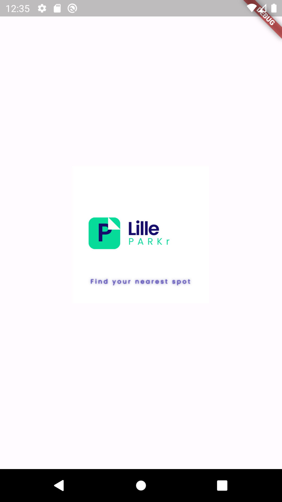
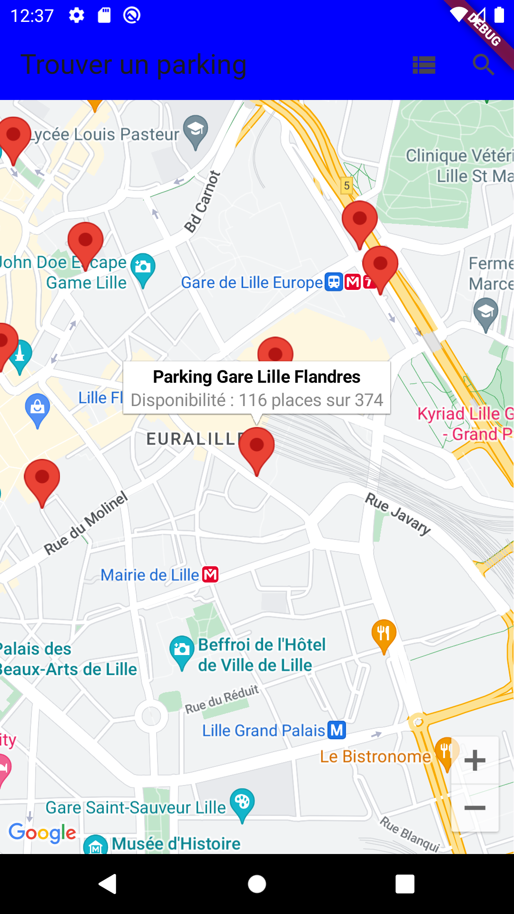
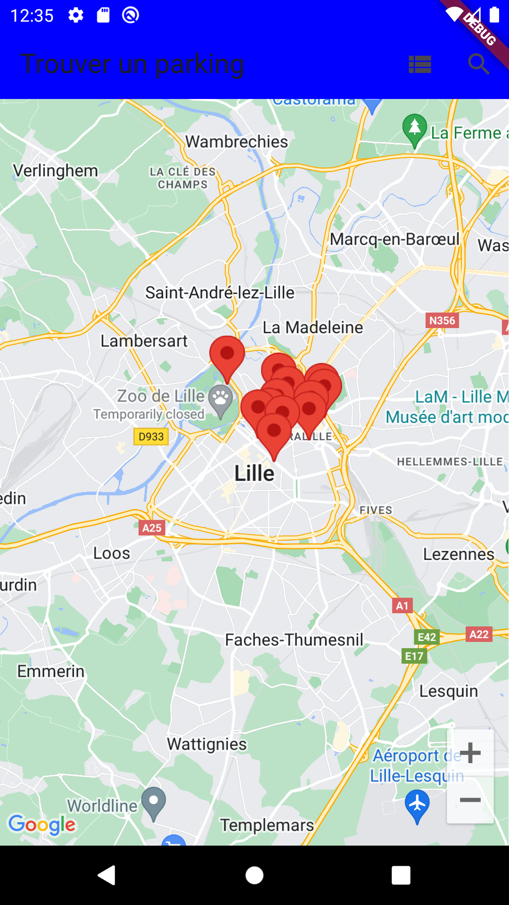
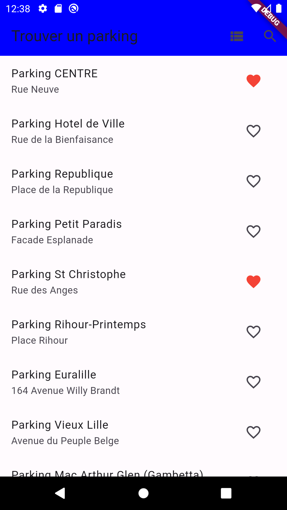
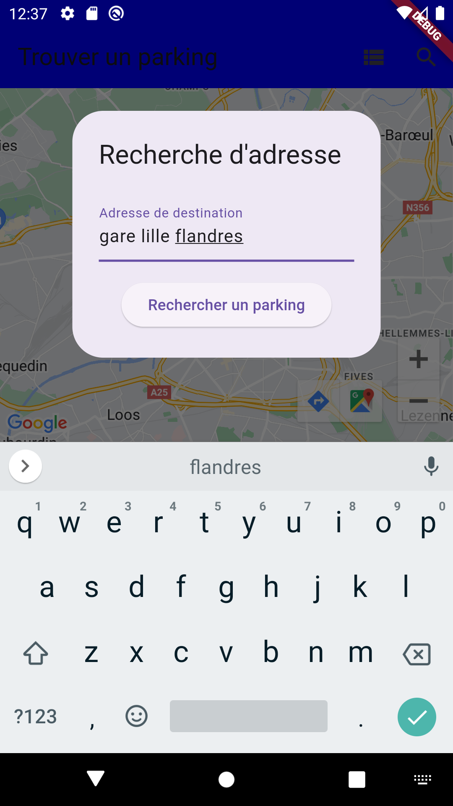
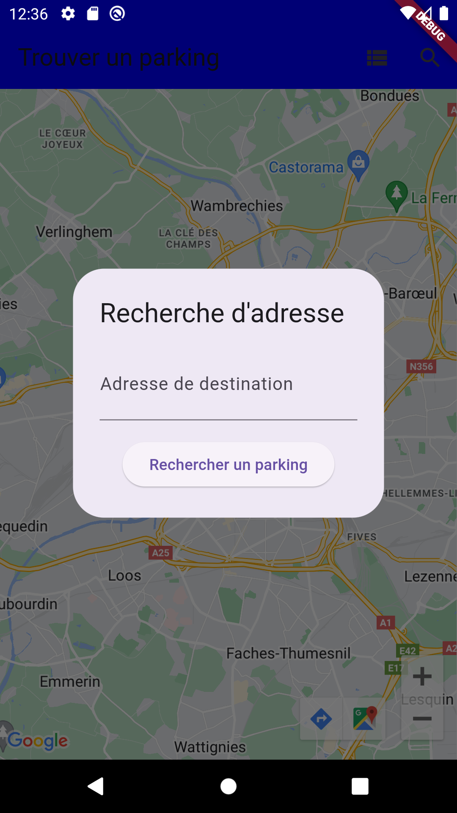

# Rapport sur "Lille PARKr"

## Description

Le projet "Lille PARKr" vise à simplifier la recherche de places de parking disponibles dans la région de Lille. En utilisant les données en temps réel sur la disponibilité des parkings, l'application aide les utilisateurs à trouver rapidement un espace de stationnement.

## Fonctionnalités Principales

Visualisation des parkings disponibles sur une carte interactive.
Recherche de parkings en fonction de l'adresse de destination.
Marquage de parkings préférés pour un accès facile.
Recommandation de parkings en fonction de l'adresse de destination.

## Captures d'Écran

## Technologies Utilisées

Flutter (framework pour le développement d'applications mobiles).
Dart (langage de programmation).
Google Maps API (pour la cartographie).
Shared Preferences (pour la gestion des préférences utilisateur).
HTTP (pour les requêtes HTTP).
Geocoding (pour la conversion d'adresses en coordonnées géographiques).

## Prérequis

Avant de commencer, assurez-vous d'avoir Flutter et Dart installés sur votre machine.

## Installation

Clonez ce dépôt sur votre machine.
Exécutez flutter pub get pour installer les dépendances.
Lancez l'application avec flutter run.

## Comment Utiliser

Lancez l'application.
Explorez les parkings disponibles sur la carte.
Utilisez la fonction de recherche pour trouver des parkings près d'une adresse spécifique.
Marquez vos parkings préférés en utilisant la fonction de favoris.

## Auteur

EL MOUDEN EL MEHDI

## Statut du Projet

En cours de développement.
