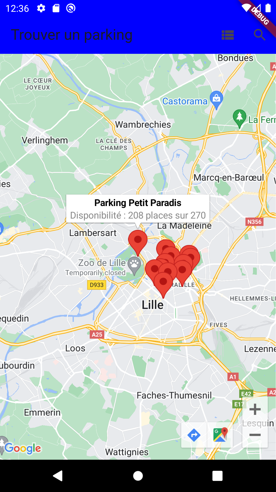

# Rapport sur "Lille PARKr"

## Description

L'application "Lille Parkr" a été développée dans le but de simplifier la recherche de places de stationnement disponibles dans la région de Lille. Cette application utilise les données en temps réel des parkings disponibles fournies par l'API ouverte de la métropole lilloise. Les utilisateurs peuvent ainsi obtenir des informations à jour sur les parkings, facilitant ainsi leur expérience de stationnement.

## Fonctionnalités Principales

1. Visualisation des Parkings
L'application propose une carte interactive qui affiche l'emplacement des parkings dans la région. Les utilisateurs peuvent explorer la carte pour trouver des parkings à proximité de leur emplacement actuel.

2. Recherche de Parkings
La fonction de recherche permet aux utilisateurs de trouver des parkings en entrant une adresse de destination. L'application recommande ensuite le parking disponible le plus proche de la destination saisie.

3. Profil Utilisateur
L'application inclut un profil utilisateur où les utilisateurs peuvent voir une liste de leurs parkings favoris.

4. Gestion des Favoris
Les utilisateurs peuvent marquer leurs parkings préférés en tant que favoris. Cela leur permet de suivre facilement les parkings qu'ils utilisent fréquemment.

5. Capture d'Écran des Fonctionnalités
Des captures d'écran sont disponibles dans le dossier "screenshots" pour donner aux utilisateurs un aperçu visuel des fonctionnalités de l'application.

## Captures d'Écran

## Technologies Utilisées

Flutter (framework pour le développement d'applications mobiles).
Dart (langage de programmation).
Google Maps API (pour la cartographie).
Shared Preferences (pour la gestion des préférences utilisateur).
HTTP (pour les requêtes HTTP).
Geocoding (pour la conversion d'adresses en coordonnées géographiques).

## Prérequis

Avant de commencer, assurez-vous d'avoir Flutter et Dart installés sur votre machine.

## Installation

Clonez ce dépôt sur votre machine.
Exécutez flutter pub get pour installer les dépendances.
Lancez l'application avec flutter run.

## Comment Utiliser

Lancez l'application.
Explorez les parkings disponibles sur la carte.
Utilisez la fonction de recherche pour trouver des parkings près d'une adresse spécifique.
Marquez vos parkings préférés en utilisant la fonction de favoris.

## Auteur

EL MOUDEN EL MEHDI

## Statut du Projet

En cours de développement.
